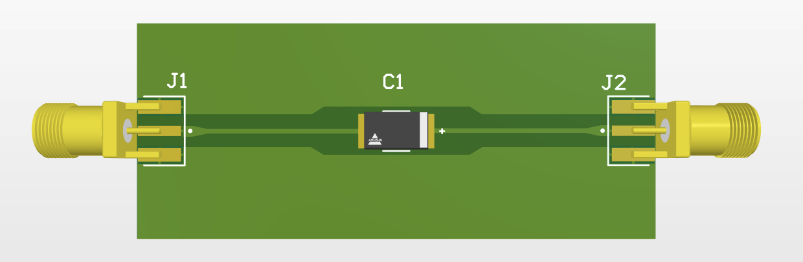

# RFTP2917
## Description
- RF Test Pad for 2917 Package, designed in Altium Designer.
- Board dimension: 60mm x 25mm
- RF trace: impedance control at 50Ω, ~0.5mm width
## Design Updates
- The RF input pin geometry is wider than the required 50 Ω microstrip width so gradual tapered transition was introduced from the pin pad to the 50 Ω RF trace. The taper helps provide a smoother impedance transition and reduces potential return loss at the interface. The same is performed for GND pin

